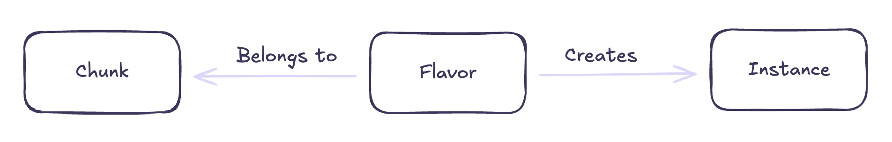

# Concepts

This section will cover the fundamental building blocks of the Chunk Explorer.

There are basically three important ones:
- Chunks
- Flavors
- Instances

A Chunk is the primary object that you will be interacting with. It represents a specific piece of content and its variations 
that we call Flavors. For example, if you have a BedWars Chunk, possible flavors could be 8x1 or 8x4. Instances on the other 
hand, are running replicas of a specific Chunk Flavor. So, when you select a Flavor an Instance will be created, that you can 
connect to once it's ready.

