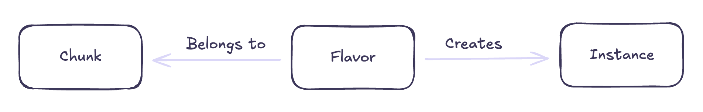

## Getting started

Here, we will cover the basics on how to get started with the Chunk Explorer. Happy reading!

## Table of Contents

- [Concepts](#concepts)
- [Project setup](#project-setup)
    - [Configuration](#configuration)
    - [Sample project directory layout](#sample-project-directory-layout)
- [Publishing your Chunk](#publishing-your-chunk)
    - [Retry publishing on errors](#retry-publishing-on-errors)

## Concepts

This section will cover the fundamental building blocks of the Chunk Explorer.

There are basically three important ones:
- Chunks
- Flavors
- Instances



A Chunk is the primary object that you will be interacting with. It represents a specific piece of content and its variations
that we call Flavors. For example, if you have a BedWars Chunk, possible flavors could be 8x1 or 8x4. Instances on the other
hand, are running replicas of a specific Chunk Flavor. So, when you select a Flavor an Instance will be created, that you can
connect to once it's ready.

## Project setup

Now, we will cover how you can set up your project, so it's ready to be published to the Chunk Explorer! At the moment,
publishing is only possible using our CLI tool. With it, you will be able to perform all important operations regarding
Chunks and Flavors, like creating, updating and so on. So, make sure you have it installed!

### Configuration

The CLI works by looking for a config file called `.chunk.yaml` containing all important configuration options for your
Chunk. Below is a sample config:

```yaml
version: v1alpha1
chunk:
  # The name of your chunk (50-character limit)
  name: MyChunk
  # Describe your chunks in a few words (100-character limit)
  description: this is a description
  # You can have up to 4 tags categorizing your Chunk (25-character limit)
  tags:
    - tag1
    - tag2
  flavors:
      # The name of one of your flavors (25-character limit)
    - name: flavor1
      # The version of your flavor (25-character limit)
      version: v1
      # The Minecraft version your Flavor runs on
      minecraftVersion: 1.21.8
      # The path to the directory where your Minecraft server
      # configuration lives. Currently, only Paper is supported.
      path: ./my_chunk/flavor1
```

### Sample project directory layout

Here is a sample layout of a BedWars minigame, which demonstrates how you could structure your project. If you have different
requirements regarding your directory layout, you can simply specify different paths.

```
bedwars
├── 8x1
│  ├── bukkit.yml
│  ├── commands.yml
│  ├── plugins
│  │  ├── bedwars
│  │  │  └── config.yaml
│  │  └── bedwars.jar
│  ├── server.properties
│  ├── spigot.yml
│  └── world
├── 8x4
│   ├── bukkit.yml
│   ├── commands.yml
│   ├── plugins
│   │  ├── bedwars
│   │  │  └── config.yaml
│   │  └── bedwars.jar
│   ├── server.properties
│   ├── spigot.yml
│   └── world
└── .chunk.yaml
```

The config file for this layout would look like the following

```yaml
version: v1alpha1
chunk:
  name: BedWars
  description: Simple BedWars minigame
  tags:
    - pvp
    - bedwars
  flavors:
    - name: 8x1
      version: v1
      minecraftVersion: 1.21.8
      path: ./8x1
    - name: 8x4
      version: v1
      minecraftVersion: 1.21.8
      path: ./8x4
```

## Publishing your Chunk

Before you can publish your Chunk make sure you meet these requirements:
- Have the CLI installed
- Have a project ready and set up. If not see [Project Setup](#project-setup) to get an introduction of how to do it.

Once you have everthing ready, head over to your directory where your project lives and execute

```
explorer chunk publish
```

this will create a Chunk and Flavor, if they don't already exist, as well as creating an execution plan, that will give
insights on what will happen if you proceed with publishing.

For example, it will show what flavors are new, what files where added, changed or removed since the last version,
if there are any other actions, like file uploads that need to be done and so on.

Publishing for the first time will lead to an execution plan that looks something like this:

```
New flavors:
 MyFlavor:
  + Version:  v1
  + Path:     ./chunk/flavor1
  + Files:
    +  banned-ips.json
    +  banned-players.json
    +  bukkit.yml
    +  commands.yml
    +  config/paper-global.yml
    +  config/paper-world-defaults.yml
    +  eula.txt
    +  help.yml
    +  ops.json
    +  permissions.yml
    +  plugins/bStats/config.yml
    +  plugins/spark/config.json
    +  plugins/spark/tmp-client/about.txt
    +  server.properties
    +  spigot.yml
    +  world/data/chunks.dat
    +  world/data/raids.dat
    +  world/data/random_sequences.dat
    +  world/data/scoreboard.dat
    +  world/datapacks/bukkit/pack.mcmeta
    +  world/level.dat
    +  world/paper-world.yml
    +  world/region/r.-1.-1.mca
    +  world/region/r.-1.0.mca
    +  world/region/r.0.-1.mca
    +  world/region/r.0.0.mca
    +  world/stats/92de217b-8b2b-403b-86a5-fe26fa3a9b5f.json
    +  world/uid.dat

Are you sure you want to publish? (y/n):
```

It shows all files that have been added as well as information about the flavor. This output will be repeated, if there
are more flavors present. Entering `y` will start the publishing process.

### Retry publishing on errors

As with all things, errors are something to expect, so, if, for example, the server is not available or a build step
failed, you can simply execute the command again and the execution plan will show you the action that will be performed
for the flavor that failed to be published.

```
Actions to be performed for the following flavors:
 MyFlavor => Retry uploading files

Are you sure you want to publish? (y/n):
```

The following actions can be retried:
- File upload failed
- Image building failed
- Checkpoint building failed
